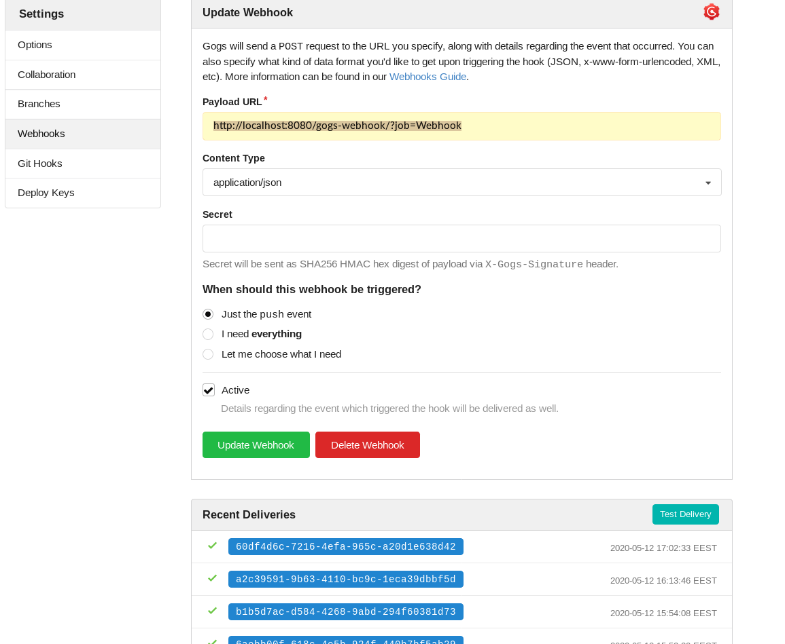

This project describes a data acquisition and analytics pipeline based on Jenkins, Python and Gogs(a private Github repo).
Jenkins, a CI/CD tool mostly used in DevOps, will automate the complete process. Python scripts will do the heavy lifting. When triggered by Jenkins the scripts will pull the data and generate the analytics.
Gogs will act both as Private and Public repository,
Project is centered around COVID-19 public data-sets.

The rise of Corona-19 generated a lot of community initiatives to help fight pandemic.
Within this project I show how we can use Jenkins to:

* pull data-sets from public sources
* generate the analytics
* publish the analytics

On the analytics side John Hopkins University did an admirable job. See link below:

**John Hopkins**

* https://coronavirus.jhu.edu/map.html

**Other initiatives(Italy + Siscale):**

* https://www.bloccodigitale.com/
* https://covid19.siscale.org/app/kibana#/

**Romania:**

* https://covid19.geo-spatial.org/

### Project Workflow


The workflow can be seen as a chained sequence of steps (build steps). Each successful build step triggers the next build. 

1. Data is available to the public.
2. A Jenkins job listens for new data, and based on a specific action (webhook trigger) it starts build job.
3. A Python script generates the analytics.
4. Analytics results are pushed to the public

### Jenkins architecture

Architecturally, Jenkins is fairly simple. Users of Jenkins create and maintain jobs, or projects. A project
is a collection of steps, also called builds. The term “Build” comes from Jenkins’ heritage as a build
automation system. “Building” software typically refers to the process of compilation, in which high-
level, human-written code is translated to machine code.

Jenkins organizes each project into it's home directory workspace.

### Jenkins directory tree

```jql
├── environment.yml
├── project_env.yml
├── requirements.txt
├── Generate_Analytics
│   ├── Images
│   │   ├── county_numbers.png
│   │   ├── covid_timeseries.png
│   │   ├── covid_trends.png
│   │   ├── general_stats.png
│   │   ├── total_county.png
│   │   ├── total_dead.png
│   │   └── total_healed.png
│   └── README.md
├── Upload
│   ├── Images
│   │   ├── county_numbers.png
│   │   ├── covid_timeseries.png
│   │   ├── covid_trends.png
│   │   ├── general_stats.png
│   │   ├── Images
│   │   │   ├── county_numbers.png
│   │   │   ├── covid_timeseries.png
│   │   │   ├── covid_trends.png
│   │   │   ├── general_stats.png
│   │   │   ├── total_county.png
│   │   │   ├── total_dead.png
│   │   │   └── total_healed.png
│   ├── README.md
├── Webhook
│   ├── datasets
│   │   ├── getCasesByCounty.json
│   │   ├── getDailyCaseReport.json
│   │   ├── getDeadCasesByCounty.json
│   │   ├── getHealthCasesByCounty.json
│   │   └── romania-counties.json
```

### (1st Job) Pull data 

The first job listens for new data. This is done through a webhook trigger. When new data is available a notification is sent to Jenkins.
Jenkins pull the datasets.
The trigger is based on committed data to a public repo.
But this functionality must be configured.

#### Jenkins setup (Build job setup)


1. Click add new item
2. Choose freestyle project (name it) git it a name
3. In (Source Code Management) choose Git:
    * Repository URL (**add http repository url**):
        * http://localhost:3000/gogs/COVID_Private_Repo.git
    * Choose gogs credentials
    
4. Build trigger:
    * Check (GitHub hook trigger for GITScm polling)
    

#### Gogs webhook setup:

1. Click Settings; Webhook  
2. Setup Payload URL ```http://localhost:8080/gogs-webhook/?job=Webhook``` 
3. Check (Webhook based on push event)
4. Activate is and test delivery



### (2nd Job Analytics)

1. Create a new job(see previous Jenkins steps 1 and 2)
2. In build section check [execute shell script]:

```jql
py="/home/anaconda3/envs/py37_covidenv/bin/python"
$bash
echo 'conda activate project_env'
home="/var/lib/jenkins/workspace/Generate_Analytics/code"
$py $home/analytics.py
```

The first line specifies python execution path. It's entirely possible that within a deployment you could have multiple python verions with different libraries installed.
The echo command execute and activate the python environment specific to this project.
The third line specifies the home directory for this project 
Last line executed the script


#### Python analytics script

Below function reads the datasets into a dataframe list. Each element in the list reresents a dataset.

```jql
#!/usr/bin/env python
# coding: utf-8


### Import Libraries ###
import pandas as pd
import json
#import geopandas as gdf
import matplotlib.pyplot as plt
import os
import geopandas as gdf
import plotly.graph_objects as go
import plotly.figure_factory as ff
import plotly.io
import plotly.offline as offline

plotly.io.orca.config.executable="/home/anaconda3/envs/py37_covidenv/bin/orca"
plotly.io.orca.config.save()


'''Init prophet model'''

from fbprophet import Prophet
m = Prophet()

import warnings
warnings.filterwarnings('ignore')

#gdf.crs="EPSG:31700"

def read_data(data_dir):
	#data_dir=os.path.join(os.path.dirname(os.getcwd()),"datasets/")
	file_list=[]
	for file in os.listdir(data_dir):
		if file.endswith("json") and "romania-counties" not in file:
			print(file)
			file_list.append(file)


	df_list=[]
	for f in file_list:
		if "getDailyCaseReport" not in file_list:
			d=os.path.join(data_dir,f)
			d_dict=pd.read_json(d)['data'][0]
			df=pd.DataFrame(d_dict)


		else:
			d_dict = pd.read_json('getDailyCaseReport.json')['data'][0]
			df = pd.DataFrame(d_dict)

		df_list.append(df)

	df1,df2,df3,df4=df_list[0],df_list[1],df_list[2],df_list[3]

	return df_list


def add_geodata(df1,code_dir):
	#code_dir = os.path.join(os.path.dirname(os.getcwd()), "code/")
	os.chdir(code_dir)

	ro_map1=gdf.read_file('romania-counties.json')
	#df=pd.read_csv('romania-counties.csv')
	#ro_map1=gdf.GeoDataFrame(df,crs="epsg:4326")
	ro_map1['NAME_1']=ro_map1['NAME_1'].str.upper()
	ro_map1.drop(columns=['id','NL_NAME_1','VARNAME_1'],inplace=True)
	ro_map1['NAME_1'].replace({"BUCHAREST":"BUCUREȘTI"},inplace=True)	
	total=ro_map1.merge(df1,left_on='NAME_1',right_on="county")
	total.drop(columns=['county'],inplace=True)

	return(total)

def get_statistics(df1):
	stats=df1.describe()
	stats.drop(index='count',inplace=True)
	stats.reset_index(inplace=True)
	stats.columns=['stats','total_county','total_healed','total_dead']
	
	return stats

def fit_4fbprohpet(df):

	df['ds'] = df['day_case']
	df['y'] = df['total_case']
	df_ts = df[['ds', 'y']]
	df_ts.head()

	return df_ts


def forecast_model(df, m=m):
	m.fit(df)
	future = m.make_future_dataframe(periods=22)
	forecast = m.predict(future)

	return forecast

def fit_4timeseries(df):

	x=[i for i in range(df.shape[0])]
	y1=df['total_case'].tolist()
	y2=df['total_healed'].tolist()
	y3=df['total_dead'].tolist()

	return x,y1,y2,y3


def plot_map(total,col):
	colors = 20
	cmap = 'Blues'
	figsize = (16, 10)
	total.plot(figsize=figsize, column=col, cmap=cmap, scheme='quantiles', k=colors, legend=True)
	#plt.axis('off')


def scatter_plot(x, y1, y2, y3):

	fig = go.Figure()
	fig.add_trace(go.Scatter(x=x, y=y1, name='Total',  line=dict(color='royalblue', width=5)))
	fig.add_trace(go.Scatter(x=x, y=y2, name='Healed', line=dict(color='firebrick', width=5)))
	fig.add_trace(go.Scatter(x=x, y=y3, name='Deaths', line=dict( width=5)))

	fig.update_layout(margin={"r": 0, "t": 0, "l": 0, "b": 0},plot_bgcolor='white')
	return fig


def trend_plots(df, title):

	fig = go.Figure(layout=dict(title=dict(text=title)))
	col_titles = ['Trend', 'Trend_Lower', 'Trend_Upper']
	cols = ['yhat', 'yhat_lower', 'yhat_upper']
	for c, t in zip(cols, col_titles):
		fig.add_trace(go.Scatter(x=df['ds'], y=df[c].tolist(), name=t, line=dict(width=5)))
	fig.update_layout(margin={"r": 0, "t": 0, "l": 0, "b": 0},plot_bgcolor='white')

	return fig

def plot_table(df):
	fig=ff.create_table(df)
	return fig


### Main ###
def main():

	home_dir="/var/lib/jenkins/workspace/CI_PUSH"
	data_dir=os.path.join(home_dir,"datasets/")
	img_dir=os.path.join(home_dir,"Images/")
	code_dir=os.path.join(home_dir,"code/")


	#img_dir=os.path.join(os.path.dirname(os.getcwd()),"Images/")
	df_list=read_data(data_dir)

	print(df_list)
	df_ts=df_list[1]
	x, y1, y2, y3=fit_4timeseries(df_ts)
	fig=scatter_plot(x, y1, y2, y3)

	fig.write_image(os.path.join(img_dir,"covid_timeseries.png"))
	#plotly.offline.plot(fig, filename='covid_timeseries.png')
	#offline.plot(fig,auto_open=False, image = 'png', image_filename='covid_timeseries.png')

	df_ts=fit_4fbprohpet(df_ts)
	df_ts=forecast_model(df_ts)

	fig=trend_plots(df_ts,title="Romania future trends")
	fig.write_image(os.path.join(img_dir,"covid_trends.png"))
	#plotly.offline.plot(fig, filename='covid_trends.png')
	#offline.plot(fig,auto_open=False, image = 'png', image_filename='covid_trends.png')

	df1=df_list[0]
	total=add_geodata(df1,code_dir)
	
	for c in ['total_county','total_healed','total_dead']:
		plot_map(total,col=c)
		name=c+".png"
		plt.savefig(img_dir + name,bbox_inches='tight')
	
	df=df1[df1.columns[1:]]
	fig=plot_table(df)
	fig.write_image((os.path.join(img_dir,"county_numbers.png")))
	#plotly.offline.plot(fig, filename="county_numbers.png")
	#offline.plot(fig,auto_open=False, image = 'png', image_filename='country_numbers.png')

	df=get_statistics(df1)
	fig=plot_table(df)
	fig.write_image(os.path.join(img_dir,"general_stats.png"))
	#plotly.offline.plot(fig, filename="general_stats.png")
	#offline.plot(fig,auto_open=False, image = 'png', image_filename='general_stats.png')


if __name__=="__main__":
	main()
```

