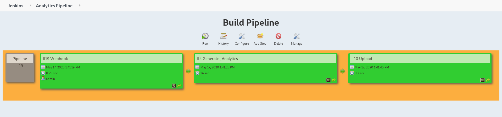
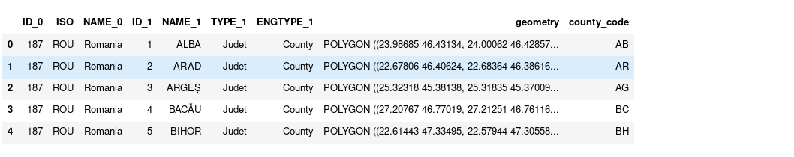

This project describes a data acquisition and analytics pipeline based on Jenkins, Python and Gogs (a private Github repo).
Jenkins, a CI/CD tool mostly used in DevOps, will automate the complete process. Python scripts will do the heavy lifting. When triggered by Jenkins the scripts will pull the data and generate the analytics.
Gogs will act both as Private and Public repository. To showcase this functionality I created COVID_Public and a COVID_Private repositories. The published data on the "Public" repository will trigger a chain of events which will generate some analytics.

Jenkins has been configured to “listen” for webhook requests.
Each time a commit is pushed to the master branch of the Public_Repo, Gogs will send the webhook trigger to Jenkins.

[Datasets available here](https://covid19.geo-spatial.org/) 

The public repo will host a “template markdown” with placeholders/filling for the analytics.
The analytics script will generate images and when the  pipeline finishes its execution, it will fill in that placeholders. As an end result you will have an up to date statistics from COVID-19 data.

### Markdon template

```
# Romania_COVID_Analytics(Under construction)
Representations of COVID data for Romania
### General stats

### Time Series 
The graph show the current **COVID-19** evolution:

### COVID growing rates
 
## Total cases by county (left) | Total dead by county (right)
  
### Numbers by county

```


The rise of Corona-19 generated a lot of community initiatives to help fight pandemic.  
On the analytics side, John Hopkins University did an admirable job. But there where also other good projects.  
See the links below:

[**John Hopkins University**](https://coronavirus.jhu.edu/map.html)    
[**Italy**](https://www.bloccodigitale.com/)    
[**Siscale**](https://covid19.siscale.org/app/kibana#/)   
[**Romania**](https://covid19.geo-spatial.org/)   

Within this project I show how we can use Jenkins to:

* pull data-sets from public sources
* generate the analytics
* publish the analytics

### Project Workflow


The workflow can be seen as a chained sequence of steps (build steps). Each successful build step triggers the next build. 

1. Data is available to the public.
2. A Jenkins job listens for new data, and based on a specific action (webhook trigger) it starts a build job.
3. A Python script generates the analytics.
4. Analytics results are pushed to the public

### Jenkins architecture

Architecturally, Jenkins is fairly simple. Users of Jenkins create and maintain jobs, or projects. A project
is a collection of steps, also called builds. The term “Build” comes from  the Jenkins heritage as a build
automation system. “Building” software typically refers to the process of compilation, in which high-level, human-written code is translated to machine code.

Jenkins organizes each project into its home directory workspace ("/var/lib/jenkins/workspace").
Each build job has its own directory, where each step in the job gets executed.  
There are 3 build spaces: Webhook | Generate_Analytics | Upload  
Each build job triggers upon successful execution the next job.


### Jenkins directory tree

```jql
├── environment.yml
├── project_env.yml
├── requirements.txt
├── Generate_Analytics
│   ├── Images
│   └── README.md
├── Upload
│   ├── Images
│   ├── README.md
├── Webhook
│   ├── datasets
│   │   ├── getCasesByCounty.json
│   │   ├── getDailyCaseReport.json
│   │   ├── getDeadCasesByCounty.json
│   │   ├── getHealthCasesByCounty.json
│   │   └── romania-counties.json
```

### Analytics end-to-end pipeline



### Webhook

The first job listens for new data. This is done through a webhook trigger. When new data is available a notification is sent to Jenkins.
Following this event the dataset will be donwloaded locally.
The trigger is based on committed data to a public repo, but this functionality must be configured.

#### Jenkins setup (Build job setup)

1. Click add new item
2. Choose freestyle project (name it/give the project a name)
3. In (Source Code Management) choose Git:
    * Repository URL (**add http repository url**): 
         http://localhost:3000/gogs/COVID_Private_Repo.git  
    * Choose gogs credentials
4. Build trigger:
    * Check (GitHub hook trigger for GITScm polling)
    

#### Gogs webhook setup:

1. Click Settings; Webhook  
2. Setup Payload URL ```http://localhost:8080/gogs-webhook/?job=Webhook``` 
3. Check (Webhook based on push event)
4. Activate it and test delivery


### Generate_Analytics

1. Create a new job (see previous Jenkins steps 1 and 2)
2. In build section check [execute shell script]:

### Shell commands:
```
py="/home/anaconda3/envs/py37_covidenv/bin/python"
$bash
echo 'conda activate project_env'
home="/var/lib/jenkins/workspace/Generate_Analytics/code"
$py $home/analytics.py
```
The first line tells Jenkins where to look for the python version specific to our project.  
The second line activates the bash shell. Jenkins does not use bash, and to avoid unwated behavior it's best to activate it.     
The third line activates this particular python environment. Conda/Anaconda gives the user the opportunity to create "virtual python deployments". These "separated python mediums" can have different libraries.  
Home specifies the location of our code. The last line executes the script.

 
[Link to code](https://github.com/mpruna/Romania_COVID_Analytics/blob/master/code/analytics.py)

### Code breakdown

**read_data** function loads the data-sets into pandas dataframe objects.    
**add_geodata** concatenates geographical coordinates.   
**get_statistics** calculates the mean/standard deviation /minimum & maximum  values. 
**fit_fit_4fbprohpet** makes the necessary transformations on the data. The forecasting function requires a two column dataframe.  The ds column represents the day number, and y represents the actual count.  
**fit_4timeseries** transforms time series data into lists. This manipulation is necessary for the time series plotting function. The series graphs (confirmed;recovered;dead numbers).    
**plot_map** draws the number Romania map. Color intensity is proportional with count number.  
**scatter_plot** draws time series data.    
**forecast_model** does a 22 day forecast.  

### Geo DataFrame



The "geometry" column in our dataset contains Polygon county boundries, each corresponding to a different region in Romania.  
There are different geometry type and the most common are: Point, LineString, or Polygon.  


### Upload

Similar to the previous build job, setup the Github repo url and choose the apropriate credentials. However this time, instead of the private url, I will use the public one:

```
http://localhost:3000/gogs/COVID_Public.git
```

### Build step | Shell execution
```
$bash
cp -r /var/lib/jenkins/workspace/Generate_Analytics/Images Images/
echo 'git add Images'
echo 'git commit -m "+added images"'
echo 'git push origin master'
```
The first line activates the bash shell.  
The second one copies the Images from the analytics directory to the current directory.  
The third one add/commits and pushes the code to the public repository.

References:
* https://github.com/gogs/gogs


 
 
