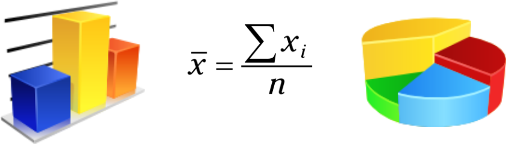

### Statistics and Analytics basics (Under Construction)

**"In the beginning was the Word, and the Word was with God, and the Word was God. He was in the beginning with God. All things were made through him, and without him was not any thing made that was made."**

Before we learn how to run we must learn how to walk. There is no skipping fundamentals.





In this mini-project, I will explain a couple of statistics and analytics terms. Everything starts with fundamentals. These notions are necessary for more advanced Machine-Learning algorithms.

A project must also have a natural progression. Each section must provide a clear answer and it must naturally lead to the next step or chapter.

Choosing the appropriate plots or graphics is equally important as some graphs are better than others to deliver an idea.

Choosing the appropriate plots or graphics is equally important as some graphs are better than others to deliver an idea.

The whole idea behind analytics is to make sense of the data, and provide some answers which could guide future decisions.

Data manipulation is necessary for some circumstances. Data might come in different formats and we must convert the data if we want to do forecast or model it.


I will explain terms such as:

- populations and samples

- distributions

- mean median mode

- outliers

  

I will also dive a little bit into some data cleaning and manipulation techniques. And also I will show what and when should we choose a specific type of plot.

### Fighter Dataset


### UFC Events Dataset


#### Sampling and Population

If we want an accurate answer for a question we must poll the entire population. But this is not achievable due to money, time, and resources constraints.

In statistical terms, we want our samples to be representative of their corresponding populations. If a sample is relevant, then the sampling error is low. The more representative a sample is, the smaller the sampling error. The less representative a sample is, the greater the sampling error.

In statistics, the set of all individuals relevant to a particular statistical question is called a population. For our analysis, all the fighters from the UFC represent a population.


#### Sample vs. Population

Whether something is a sample or population it depends on the point of view. If we are talking about all the fighters from the UFC, then we are dealing with a population. But UFC fighters represent a sample if we are dealing with all the fighters from all the sports.


#### Variables | Scales 

If we examine these two datasets we see that each row of data contains some properties.
The properties having distinct values are called variables. These variables can either describe quantities or qualities.
For example, the Instagram and Tweeter variables describe quantities. These columns describe how many followers each fighter has.

A few variables in our dataset describe qualities. Generally, qualitative variables describe what or how something is.

**Name**, **Nation**, or **Category** columns describe a quality for each fighter. Qualitative or categorical variables don’t have a direction. We can’t tell if something is better then something else. We can’t say that Daniel Cormier is a better the name then Derrick Lewis. We can’t say that a fighter is better than another based on his home country.


If we look at the Category variable we can say that a fighter is heavier or lighter then another fighter. We have as well a sense of direction. But we can't tell for sure how big the difference is. This is because categories have lower and upper limits, and a fighter can fit anywhere in between.


The system of rules that define how each variable is measured is called the **scale of measurement** or, less often, **level of measurement**.

A variable measured on a scale that preserves the order between values, and has well-defined intervals using real numbers, is an example of a variable measured either on an **interval scale** or on a **ratio scale**.

In practice, variables measured on interval or ratio scales are very common. Instagram and Twitter columns can be measured on an interval or ratio scale. What sets apart ratio scales from interval scales is the nature of the zero point.

So if something weights 0 kilograms it indicates the absence of weight. If we take into account temperature measured on the Celsius scale then zero it’s not the absolute minimum value as there might be below 0 temperatures.


|                     Variable                      | Nominal | Ordinal | Interval | Ratio |
| :-----------------------------------------------: | :-----: | ------- | -------- | ----- |
| We can tell whether two individuals are different |   YES   | YES     | YES      | YES   |
|             We can tell the direction             |   NO    | YES     | YES      | YES   |
|      We can tell the size of the difference       |   NO    | NO      | YES      | YES   |
|       We can measure qualitative variables        |   NO    | YES     | YES      | YES   |
|       We can measure qualitative variables        |   YES   | NO      | NO       | NO    |


#### Data Analytics

The fighter dataset has 171 rows and 8 columns. Each row represents some information about a fighter.

```fighter_stats.shape```

Below you can see the column description.


#### Columns


|  Column   | Description                                                  |
| :-------: | ------------------------------------------------------------ |
|  Athlete  | Name of the athlete                                          |
| Category  | Weight class ( Heavyweight \| Light-Heavyweight etc )        |
|  Gender   | Male or Female                                               |
|  Nation   | Athlete's country                                            |
|   Rank    | Rank within the organization. C is for the champ, 0,1,2 are the next ranked fighters |
|  Active   | If an athlete is active or retired                           |
|  Twitter  | Twitter followers                                            |
| Instagram | Instagram followers                                          |
| Facebook  | Facebook followers                                           |


If we view the dataset as a whole then it represents a population. But if we look at its subcategories we are dealing with samples. These categories might be weight class or gender.

Bar charts are used to compare data across categories. We can intuitively identify the differences and the direction. On the other hand, a pie chart is used to determine a percentage. We want to know how much something. With pie charts, we can immediately get a visual sense of the proportion each category takes in a distribution.


#### Nation and Category


Scatter plots on the other hand help us  find a correlation between 2 columns if the markers are close to each  other then that would mean that there is a strong correlation.


#### Mean | Mode | Standard Deviation | Distributions


Twitter and Instagram columns  are ideals for explaining mean, standard deviation concepts.

The mean also referred to by statisticians as the average, is the most common statistic used to measure the center, or middle, of a numerical data set. The mean is the sum of all the numbers divided by the total number of numbers


The average, also called the mean of a data set, is denoted by below formula:  


where each value in the data set is denoted by an x with a subscript i that goes from 1 (the first number) to n (the last number).


The standard deviation measures the deviation of numerical data. The standard deviation measures how concentrated the data are around the mean/average.

Putting a measure of center (such as the mean or median) together with a measure of variation (such as standard deviation or interquartile range) is a good way to describe the values in a population. In the case where the data are in the shape of a bell curve (that is, they have a normal distribution.

In very rough terms, is the average distance from the mean. Another way to think about standard deviation is to imagine a Gaussian distribution. From the mean, we can see how values are distributed between in quartiles.

The formula for the sample standard deviation of a data set (s) is:


### Issues

Unable to embet math formulas in markdown:

* https://help.github.com/en/github/working-with-github-pages/troubleshooting-jekyll-build-errors-for-github-pages-sites#tag-not-properly-terminated
* https://stackoverflow.com/questions/10987992/using-mathjax-with-jekyll

```
\begin{equation}
  \bar{x}=\sum\frac{xi}{n}
\end{equation}

s=\sqrt{\frac{{\sum(x-\bar{x})^2}}{n-1}}
```

Plotly Refs:

* https://plotly.com/python/images/
* https://plotly.com/python/imshow/

Plotly v 4.8:

* https://github.com/plotly/plotly.py/releases/tag/v4.8.0
* https://plotly.com/python/pandas-backend/
* https://plotly.com/python/wide-form/

Math in Markdown:

* http://csrgxtu.github.io/2015/03/20/Writing-Mathematic-Fomulars-in-Markdown/


Statistics Refs:

Statistics For Dummies - 2nd Revised Edition (2016).pdf
