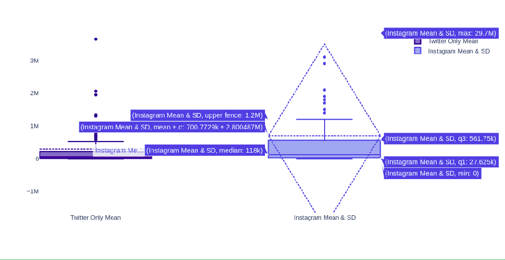
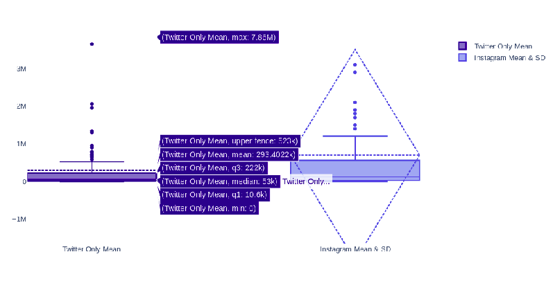

### Statistics and Analytics basics 

**"In the beginning was the Word, and the Word was with God, and the Word was God. He was in the beginning with God. All things were made through him, and without him was not any thing made that was made."**

Before we learn how to run we must learn how to walk. There is no skipping fundamentals.  
Data analysis was done with jupyter-notebook and it's available [at this location](https://github.com/mpruna/UFC-Data-Analytics).

The python specific environment can be created using anaconda. The notebook for this project is read_ufc_data.ipynb.  
Project structure on Github:

'''
├── datasets
├── environment.yml
├── Images
├── README.md
├── read_ufc_data.ipynb
├── ufcdata
└── ufc_data_analytics.ipynb
'''


In this mini-project, I will explain a couple of statistics and analytics terms. Everything starts with fundamentals. These notions are necessary for more advanced Machine-Learning algorithms.

A project must also have a natural progression. Each section must provide a clear answer and it must naturally lead to the next step or chapter.

Choosing the appropriate plots or graphics is equally important as some graphs are better than others to deliver an idea.

The whole idea behind analytics is to make sense of the data, and provide some answers which could guide future decisions.

Data manipulation is necessary for some circumstances. Data might come in different formats and we must convert the data if we want to do forecast or model it.


I will explain terms such as:

- populations and samples

- distributions

- mean median mode

- outliers

  

I also will dive a little bit into data cleaning and wrangling techniques.  
Choosing an appropriate graph to highlight some conclusions is equally important. Some graphs are better suited for some scenarios than other.  

### Fighter Dataset


### UFC Events Dataset


#### Sampling and Population

If we want an accurate answer for a question we must poll the entire population. But this is not achievable due to money, time, and resources constraints.

In statistical terms, we want our samples to be representative of their corresponding populations. If a sample is relevant, then the sampling error is low. The more representative a sample is, the smaller the sampling error. The less representative a sample is, the greater the sampling error.

In statistics, the set of all individuals relevant to a particular statistical question is called a population. For our analysis, all the fighters from the UFC represent a population.


#### Sample vs. Population

Whether something is a sample or population it depends on the point of view. If we are talking about all the fighters from the UFC, then we are dealing with a population. But UFC fighters represent a sample if we are dealing with all the fighters from all the sports.


#### Variables | Scales 

If we examine these two datasets we see that each row of data contains some properties.
The properties having distinct values are called variables. These variables can either describe quantities or qualities.
For example, the Instagram and Tweeter variables describe quantities. These columns describe how many followers each fighter has.

A few variables in our dataset describe qualities. Generally, qualitative variables describe what or how something is.

**Name**, **Nation**, or **Category** columns describe a quality for each fighter. Qualitative or categorical variables don’t have a direction. We can’t tell if something is better then something else. We can’t say that Daniel Cormier is a better the name then Derrick Lewis. We can’t say that a fighter is better than another based on his home country.


If we look at the Category variable we can say that a fighter is heavier or lighter then another fighter. We have as well a sense of direction. But we can't tell for sure how big the difference is. This is because categories have lower and upper limits, and a fighter can fit anywhere in between.


The system of rules that define how each variable is measured is called the **scale of measurement** or, less often, **level of measurement**.

A variable measured on a scale that preserves the order between values, and has well-defined intervals using real numbers, is an example of a variable measured either on an **interval scale** or on a **ratio scale**.

In practice, variables measured on interval or ratio scales are very common. Instagram and Twitter columns can be measured on an interval or ratio scale. What sets apart ratio scales from interval scales is the nature of the zero point.

So if something weights 0 kilograms it indicates the absence of weight. If we take into account temperature measured on the Celsius scale then zero it’s not the absolute minimum value as there might be below 0 temperatures.


|                     Variable                      | Nominal | Ordinal | Interval | Ratio |
| :-----------------------------------------------: | :-----: | ------- | -------- | ----- |
| We can tell whether two individuals are different |   YES   | YES     | YES      | YES   |
|             We can tell the direction             |   NO    | YES     | YES      | YES   |
|      We can tell the size of the difference       |   NO    | NO      | YES      | YES   |
|       We can measure qualitative variables        |   NO    | YES     | YES      | YES   |
|       We can measure qualitative variables        |   YES   | NO      | NO       | NO    |


#### Data Analytics

The fighter dataset has 171 rows and 8 columns. Each row represents some information about a fighter.

```
  fighter_stats.shape
```

Below you can see the column description.


#### Columns


|  Column   | Description                                                  |
| :-------: | ------------------------------------------------------------ |
|  Athlete  | Name of the athlete                                          |
| Category  | Weight class ( Heavyweight \| Light-Heavyweight etc )        |
|  Gender   | Male or Female                                               |
|  Nation   | Athlete's country                                            |
|   Rank    | Rank within the organization. C is for the champ, 0,1,2 are the next ranked fighters |
|  Active   | If an athlete is active or retired                           |
|  Twitter  | Twitter followers                                            |
| Instagram | Instagram followers                                          |
| Facebook  | Facebook followers                                           |


If we view the dataset as a whole then it represents a population. But if we look at its subcategories we are dealing with samples. These categories might be weight class or gender.

Bar charts are used to compare data across categories. We can intuitively identify the differences and the direction. On the other hand, a pie chart is used to determine a percentage. We want to know how much something represents from the total. With pie charts, we can immediately get a visual sense of the proportion each category takes in a distribution.


#### Nation and Category


#### Female versus Male fighters


#### Mean | Mode | Standard Deviation | Distributions


Twitter and Instagram columns  are ideals for explaining mean, standard deviation concepts.

The mean also referred to by statisticians as the average, is the most common statistic used to measure the center, or middle, of a numerical data set. The mean is the sum of all the numbers divided by the total number of numbers


The average, also called the mean of a data set, is denoted by below formula:  


where each value in the data set is denoted by an x with a subscript i that goes from 1 (the first number) to n (the last number).


The standard deviation measures the deviation of numerical data. The standard deviation measures how concentrated the data are around the mean/average.

Putting a measure of center (such as the mean or median) together with a measure of variation (such as standard deviation or interquartile range) is a good way to describe the values in a population. In the case where the data are in the shape of a bell curve (that is, they have a normal distribution.

In [statistics](https://en.wikipedia.org/wiki/Statistics) and applications of statistics, **normalization** can have a range of meanings.[[1\]](https://en.wikipedia.org/wiki/Normalization_(statistics)#cite_note-Dodge-1) In the simplest cases, **normalization of ratings** means adjusting values measured on different scales to a notionally common scale, often prior to averaging


In very rough terms, is the average distance from the mean. Another way to think about standard deviation is to imagine a Gaussian distribution. From the mean, we can see how values are distributed between in quartiles.

The formula for the sample standard deviation of a data set (s) is:


### Twitter & Instagram Box plots

In general histograms and box plots are mostly used to show values are distributed. To see how many data points fit in a category. We could use these types of graphs for Instagram and Twitter columns.  
A box plot is a statistical representation of numerical data through their quartiles. The ends of the box represent the lower and upper quartiles, while the median (second quartile) is marked by a line inside the box.  
The lines extending from the box plots like whiskers represent the minimum and the maximum values. The dotted lines represent the outliers. We can quickly stop from these graphs that the data is skewed in one direction. Or to put this in another way data is concentrated more around certain values. There is a bigger density. 
Specific to your data more values are grouped above the mean/average value.




Line plots or area plots are ideal to show trends. These graphs are best suited for data that has a time component. We can use these types of graphs for events that have some type of seasonality. In this context, I refer to seasonality to events that repeat based on time of the day, day of the week, or yearly season.


We can see an increase in UFC events over time with a peak in 2011.


Another way to quantify the data and also to highlight the geographical component is to use a **chorpleth map.** A **choropleth map** (from [Greek](https://en.wikipedia.org/wiki/Greek_language) χῶρος "area/region" and πλῆθος "multitude") is a type of [thematic map](https://en.wikipedia.org/wiki/Thematic_map) in which areas are shaded or patterned in proportion to a statistical  variable that represents an aggregate summary of a geographic  characteristic within each area 


### Issues

Unable to embed mathematical formulas in markdown:

* https://help.github.com/en/github/working-with-github-pages/troubleshooting-jekyll-build-errors-for-github-pages-sites#tag-not-properly-terminated
* https://stackoverflow.com/questions/10987992/using-mathjax-with-jekyll


Plotly Refs:

* https://plotly.com/python/images/
* https://plotly.com/python/imshow/

Plotly v 4.8:

* https://github.com/plotly/plotly.py/releases/tag/v4.8.0
* https://plotly.com/python/pandas-backend/
* https://plotly.com/python/wide-form/

Math in Markdown:

* http://csrgxtu.github.io/2015/03/20/Writing-Mathematic-Fomulars-in-Markdown/

Wikipedia:

* https://en.wikipedia.org/wiki/Normalization_(statistics)

  
Statistics Refs: Statistics For Dummies - 2nd Revised Edition (2016).pdf
