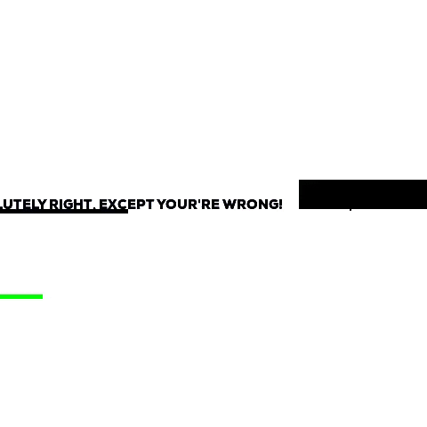
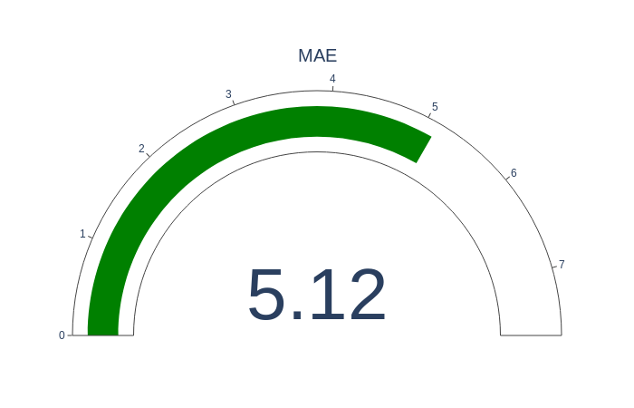
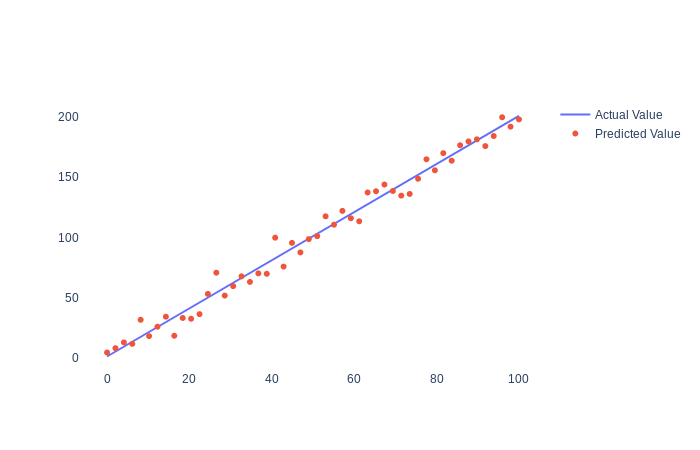
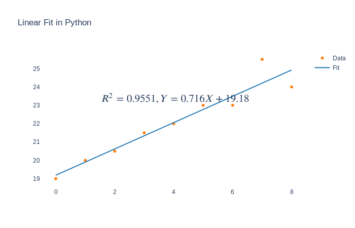

#### General Considerations

A machine-learning model can is evaluated based on several criteria. These criteria could be related to performance, computational load, or time to converge. But in this article, I will talk about the most common errors used in Machine-Learning.

The main goal of the analysis is to provide an accurate answer to a particular question. If you think about this a little bit this is an expression of life itself, it's beyond the technical domain.

So let me explain. We begin doing things with a certain belief. We have a world-view, and based on the feedback we adjust our world-view. Maybe something we thought was right turned out to be completely wrong? Hopefully, we renounce bad practices and get good ones.


#### Bit size philosophy

From a certain philosophical point of view, machine-learning is similar to the way we adjust to our environment. If we receive positive feedback it means that the way we act on the world is correct. If not, we have to change a few things. In a way this is good because it means we grow, we learn.

The general idea is not different when evaluating machine-learning algorithms. We must know how far off was the prediction. What caused the error in our model?

#### Machine Learning evaluation

The ML process begins by splitting the data into training and testing datasets. The training dataset is made up of features and labels.

These features are the attributes that predict a label or give an outcome.  

 If we use a real estate example the features for a house would be:

* number of rooms
* the year it was built 
* the size of the property

The labels are the house prices. 


After the training phase, the model is evaluated against the test dataset. This is also known as the evaluation. The differences between the prediction and the actual data tell us how good was our model. 

We use errors to score Machine-Learning models.

Some of the most common errors used in machine learning are:

- Mean Absolute Error
- Mean Squared Error
- Root Mean Squared Error
- Root Mean Square Logarithmic Error
- Mean Bias Deviation


But first, let's create some synthetic data with python generators:


```
x = np.linspace(0, 100, 50)
y = 2*x + 1

noise = np.random.normal(0, 7, y.shape)
y_2 = y + noise
```


The first two lines created a linear equation in 2D space with 50 between [0,100]. In the last two lines, we added noise or randomness, so our y coordinates don't follow a straight line. X coordinates are the same for both samples.

With this small sample, we want to simulate a real case where our model does is not perfect. As a side note, we don't want something that is 100% accurate. This is an indication of overwriting. It means that our model won't have good results against novel data.


#### Mean Absolute Error

The sum of absolute errors divided by the number of samples. Absolute means that we don't take into account the direction of the error. If xi is the actual value and yi is the predicted one, and data has n samples the MSE can be expressed with this formula:
$$
\sum_{i=1}^{n} \frac{|xi-yi|}{n}
$$



#### Mean Square Error

It’s the square root of the average of squared differences between prediction and actual observation. 
MSE formula:
$$
\frac1n{\sum_{i=1}^{n} (xi-yi)^2}
$$


MSE formula:

- n represents the number of data points. 
- xi represents the observed values, 
- yi the predicted values.


MSE is more sensitive to errors as the difference between the actual value and the forecast is squared.

#### Root Mean Squared Error

It’s the square root of the average of squared differences between prediction and actual observation. 
RMSE is calculated with the formula below:

$$
\sqrt{\sum_{i=1}^{n} \frac{(xi-yi)^2}{n}}
$$


The way RMSE is calculated has some implications. The difference between the actual and predicted values is squared before it is averaged and rooted. This means the error is much more sensitive to large errors.
RMSE is more sensitive to outliers: so the example with the largest error would skew the RMSE. MAE is less sensitive to outliers.
An outlier in our case would be something that is not grouped around other values something that does not fit a particular pattern.

#### Root Mean Square Logarithmic Error

RMSLE metric only considers the relative error between and the predicted and the actual value. The scale of the error is not important.

$$
\sqrt{\sum_{i=1}^{n} \frac{(log(xi+1)-log(yi-1)^2}{n}}
$$
Reference:

* https://medium.com/analytics-vidhya/root-mean-square-log-error-rmse-vs-rmlse-935c6cc1802a


#### MAPE

MAPE is the sum of the individual absolute errors divided by each time frame. So it calculates the percentage error at time-frame n. It should not be used on low volume data as it could give a negative assessment of actual data. Imagine this scenario, you have an e-commerce site and during summer holidays your sales decrease but some products have a higher demand than others. You could mislead this by thinking this will be the case when purchases are within normal values.


#### R Squared

R squared it's used to find the optimal parameters in a linear regression model. A linear function is a function whose graph is a straight line on a 2D space. And we want to find out what is the best parameter we can come up with to approximate a function.






R-squared (R2) is a statistical that measures the dependence of two variables. If we have a variable **x and y=f(x)**, then based on the input x, f(x) should be predictable.


 

Refs:   

https://en.wikipedia.org/wiki/Coefficient_of_determination  

https://blog.minitab.com/blog/adventures-in-statistics-2/regression-analysis-how-do-i-interpret-r-squared-and-assess-the-goodness-of-fit  

https://www.investopedia.com/terms/r/r-squared.asp  


References:

* https://en.wikipedia.org/wiki/Mean_squared_error
* https://en.wikipedia.org/wiki/Mean_absolute_error
