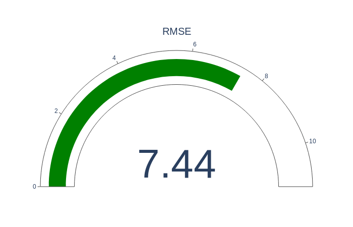

Prerequisites

For this article, I used a python environment created with anaconda.
The backbone of the environment is Python version 3.7.6. The analytics were done with the jupyter-notebook. Jupyter-notebook is an interactive web wrapper for python and other programming languages.
The project is hosted here.

Github project structure

```
├── environment.yml
├── eval_error.py
├── linear_regression.ipynb
├── plotly_linear_model.ipynb
└── README.md
```
#### Description

* environment.yml contains the project specifications
* eval_error.py python script calculates the errors
*.ipynb are two jupyter-notebooks mostly used for graphing 

Anaconda environment can be installed with below command:

```
conda env create -f environment.yml
```

#### General Considerations

A machine-learning model can be evaluated based on several criteria. These criteria could be related to performance, computational load, or time to converge. But in this article, I will talk about the most common errors used in Machine-Learning.

The main goal of the analysis is to provide an accurate answer to a particular question. If you think about this a little bit this is an expression of life itself, it's beyond the technical domain.

So let me explain. We begin doing things with a certain belief. We have a world-view, and based on the feedback we adjust our world-view. Maybe something we thought was right turned out to be completely wrong? Hopefully, we renounce bad practices and get good ones.


#### Bit size philosophy

From a "philosophical point of view", Machine-Learning is analogous to our World-View. If we receive positive feedback it means that the way we act on the world is correct. If not, we have to change a few things. In a way this is good because it means we grow, we learn.

The general idea is not different when evaluating machine-learning algorithms. We must know how far off was the prediction. What caused the error in our model?

#### Machine Learning evaluation

The ML process begins by splitting the data into training and testing datasets. The training dataset is made up of features and labels.

These features are the attributes that predict a label or give an outcome.  

 If we use a real estate example the features for a house would be:

* number of rooms
* the year it was built 
* the size of the property

The labels are the house prices. 


After the training phase, the model is evaluated against the test dataset. This is also known as the evaluation. The differences between the prediction and the actual data tell us how good was our model. 

We use errors to score Machine-Learning models.

Some of the most common errors used in machine learning are:

- Mean Absolute Error
- Mean Squared Error
- Root Mean Squared Error
- Root Mean Square Logarithmic Error
- Mean Bias Deviation


But first, let's create some synthetic data with python generators:


```
x = np.linspace(0, 100, 50)
y = 2*x + 1

noise = np.random.normal(0, 7, y.shape)
y_2 = y + noise
```


The first two lines created a linear equation in 2D space with 50 between [0,100]. In the last two lines, we added noise or randomness, so our y coordinates don't follow a straight line. X coordinates are the same for both samples.

With this small sample, we want to simulate a real case where our model does is not perfect. As a side note, we don't want something that is 100% accurate. This is an indication of overwriting. It means that our model won't have good results against novel data.


#### Mean Absolute Error

The sum of absolute errors divided by the number of samples. Absolute means that we don't take into account the direction of the error. If xi is the actual value and yi is the predicted one, and data has n samples the MSE can be expressed with this formula:
$$
\sum_{i=1}^{n} \frac{|xi-yi|}{n}
$$


#### Mean Square Error

MSE is calculated by dividing the corresponding sum of squared errors to the sample size.  
MSE formula:
$$
\frac1n{\sum_{i=1}^{n} (xi-yi)^2}
$$


MSE formula:

- n represents the sample size. 
- xi represents the observed values, 
- yi the predicted values.


MSE is sizable bigger because the errors get raised to the power of two before being averaged.

#### Root Mean Squared Error

RMSE is a quadratic scoring rule that also measures the average magnitude of the error. It’s the square root of the average of squared errors. Here the error represents the difference between prediction and actual value.

RMSE is calculated with the formula below:

$$
\sqrt{\sum_{i=1}^{n} \frac{(xi-yi)^2}{n}}
$$




The way RMSE is calculated has some implications. The individual errors get raised to the power of two before bein averaged. This means the RMSE is much more sensitive to large errors. RMSE is more sensitive to outliers. Outliers are extreme values that deviate from the normal values. 

#### Root Mean Square Logarithmic Error

RMSLE metric only considers the relative error between and the predicted and the actual value. The scale of the error is not important.

$$
\sqrt{\sum_{i=1}^{n} \frac{(log(xi+1)-log(yi-1)^2}{n}}
$$


#### MAPE

MAPE is the sum of the individual absolute errors at each moment. It should not be used on low volume data.High errors during low-demand periods will have a major impact on MAPE.


#### R Squared

R squared it's used to find the optimal parameters in a linear regression model. A linear function is a function whose graph is a straight line on a 2D space. And we want to find out what is the best parameter we can come up with to approximate a function.


R-squared (R2) measures the dependence of two variables. If we have a variable x and y=f(x), then based on the input x, f(x) should be predictable. If we have a variable **x and y=f(x)**, then based on the input x, f(x) should be predictable.


 

References:   

```
* https://en.wikipedia.org/wiki/Coefficient_of_determination  
* https://blog.minitab.com/blog/adventures-in-statistics-2/regression-analysis-how-do-i-interpret-r-squared-and-assess-the-goodness-of-fit  
* https://www.investopedia.com/terms/r/r-squared.asp  
* https://medium.com/analytics-vidhya/root-mean-square-log-error-rmse-vs-rmlse-935c6cc1802a
* https://en.wikipedia.org/wiki/Mean_squared_error
* https://en.wikipedia.org/wiki/Mean_absolute_error
* https://docs.conda.io/projects/conda/en/latest/user-guide/tasks/manage-environments.html
```
