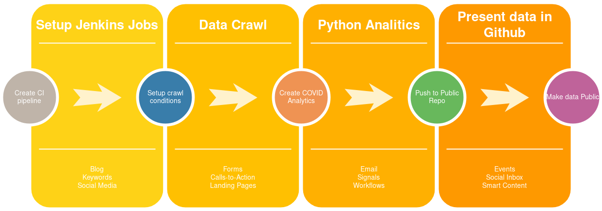

This project describes a data acquisition and analytics pipeline based on Jenkins, Python and Gogs(a private Github repo).
Jenkins, a CI/CD tool mostly used in DevOps, will automate the complete process. Python scripts will do the heavy lifting. When triggered by Jenkins the scripts will pull the data and generate the analytics.
Gogs will act both as Private and Public repository,
Project is centered around COVID-19 public data-sets.

The rise of Corona-19 generated a lot of community initiatives to help fight pandemic.
Within this project I show how we can use Jenkins to:

* pull data-sets from public sources
* generate the analytics
* publish the analytics

On the analytics side John Hopkins University did an admirable job. See link below:

### John Hopkins

* https://coronavirus.jhu.edu/map.html

### Other initiatives(Italy + Siscale):

* https://www.bloccodigitale.com/covid/?fbclid=IwAR3dOnZpxVBQSrXfzT40oTNY30M1h1cPXF55t85WCOUZsCDFi80H4U1zXuM#home
* https://covid19.siscale.org/app/kibana#/dashboard/82464cb0-64a8-11ea-b265-6519d4618375?_g=h@68f23f3&_a=h@5f51f2c

### Romania:

* https://covid19.geo-spatial.org/

### Project Workflow



The workflow can be seen as a chained sequence of steps (build steps). Each successful build step triggers the next build. 

1. Data is available to the public.
2. A Jenkins job listens for new data, and based on a specific action (webhook trigger) it starts build job.
3. A Python script generates the analytics.
4. Analytics results are pushed to the public

### Jenkins architecture

Architecturally, Jenkins is fairly simple. Users of Jenkins create and maintain jobs, or projects. A project
is a collection of steps, also called builds. The term “Build” comes from Jenkins’ heritage as a build
automation system. “Building” software typically refers to the process of compilation, in which high-
level, human-written code is translated to machine code.

Jenkins organizes each project into it's home directory workspace.

### Jenkins directory tree

```jql
├── environment.yml
├── project_env.yml
├── requirements.txt
├── Generate_Analytics
│   ├── Images
│   │   ├── county_numbers.png
│   │   ├── covid_timeseries.png
│   │   ├── covid_trends.png
│   │   ├── general_stats.png
│   │   ├── total_county.png
│   │   ├── total_dead.png
│   │   └── total_healed.png
│   └── README.md
├── Upload
│   ├── Images
│   │   ├── county_numbers.png
│   │   ├── covid_timeseries.png
│   │   ├── covid_trends.png
│   │   ├── general_stats.png
│   │   ├── Images
│   │   │   ├── county_numbers.png
│   │   │   ├── covid_timeseries.png
│   │   │   ├── covid_trends.png
│   │   │   ├── general_stats.png
│   │   │   ├── total_county.png
│   │   │   ├── total_dead.png
│   │   │   └── total_healed.png
│   ├── README.md
├── Webhook
│   ├── datasets
│   │   ├── getCasesByCounty.json
│   │   ├── getDailyCaseReport.json
│   │   ├── getDeadCasesByCounty.json
│   │   ├── getHealthCasesByCounty.json
│   │   └── romania-counties.json
```
