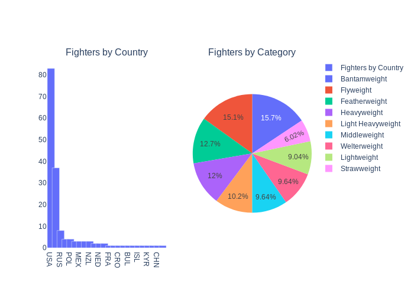

### Statistics and Analytics basics (Under Construction)

**"In the beginning was the Word, and the Word was with God, and the Word was God. He was in the beginning with God. All things were made through him, and without him was not any thing made that was made."**

Before we learn how to run we must learn how to walk. There is no skipping fundamentals.


In this mini project I will explain a couple of statistics and analytics key concepts.  
Everything starts with fundamentals and these concepts are key for more advances Machine-Learning. 

Related to statistical math I will explain terms such as:

* populations and samples
* distributions
* mean | media | mode
* outliers

I will also dive a little bit into some data cleaning and manipulation techniques. And also I will show what and when should we choose a 
specific type of plots.

### Figher Dataset

```
Athlete 	Category 	Gender 	Nation 	Rank 	Active 	Twitter 	Instagram 	Facebook
0 	Daniel Cormier 	Heavyweight 	M 	USA 	C 	YES 	709000 	1900000 	NaN
1 	Stipe Miocic 	Heavyweight 	M 	USA 	1 	YES 	239000 	774000 	NaN
2 	Francis Ngannou 	Heavyweight 	M 	FRA 	2 	YES 	99700 	497000 	NaN
3 	Derrick Lewis 	Heavyweight 	M 	USA 	3 	YES 	148000 	1500000 	NaN
4 	Curtis Blaydes 	Heavyweight 	M 	USA 	4 	YES 	12700 	79100 	NaN
```

### UFC Events Dataset

```
 	Event 	Date 	Venue 	City 	State/Province 	Country 	Attendance 	EVENT # 	PPV 	Explanation 	Month 	Year 	Extra Notes
0 	UFC 1: The Beginning 	1993-11-12 	McNichols Sports Arena 	Denver 	Colorado 	U.S. 	7800 	UFC 1 	Not Available 	Pre-PPV 	November 	1993 	NaN
1 	UFC 2: No Way Out 	1994-03-11 	Mammoth Gardens 	Denver 	Colorado 	U.S. 	2000 	UFC 2 	Not Available 	Pre-PPV 	March 	1994 	NaN
2 	UFC 3: The American Dream 	1994-09-09 	Grady Cole Center 	Charlotte 	North Carolina 	U.S. 	NaN 	UFC 3 	Not Available 	Pre-PPV 	September 	1994 	NaN
3 	UFC 4: Revenge of the Warriors 	1994-12-16 	Expo Square Pavilion 	Tulsa 	Oklahoma 	U.S. 	5857 	UFC 4 	Not Available 	Pre-PPV 	December 	1994 	NaN
4 	UFC 5: The Return of the Beast 	1995-04-07 	Independence Arena 	Charlotte 	North Carolina 	U.S. 	6000 	UFC 5 	Not Available 	Pre-PPV 	April 	1995 	NaN
```

If we examine these 2 datasets we see that each row of data contains some properties.   
These properties having distinct values are called variables. Variables can either describe quantities of qualities.  
For instance the Instagram and Tweeter variable describe quantities. These collumns describe  how much followers each fighter has.  
But Name, Nation, or Category describe a quality for each fighter. Variables that describe qualities are called qualitative or categorical variables.    
Qualitative or categorial variables don't have a direction, or in other words can't really tell if something is better then something else. For instance we can't say that as a name **Daniel Cormier** is better the **Derrick Lewis**.

### Nation and Category


